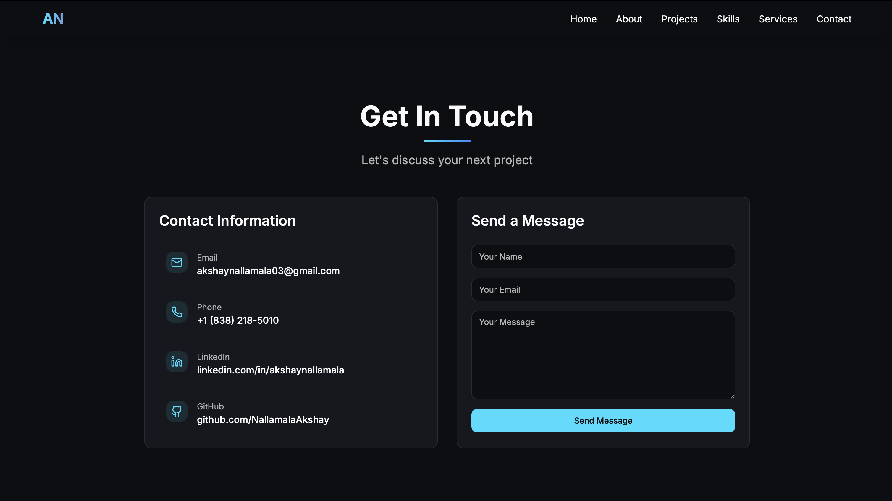

<div align="center">

# 👋 Hey there, I'm **Akshay Nallamala**
### 🚀 Full-Stack Developer | AI & Data Analytics Enthusiast

🌐 [akshaynallamala.online](https://akshaynallamala.online)  
📩 [akshaynallamala03@gmail.com](mailto:akshaynallamala03@gmail.com)  
💼 [LinkedIn](https://www.linkedin.com/in/akshaynallamala/) • [GitHub](https://github.com/NallamalaAkshay)

</div>

---

## 🧠 About Me
I’m a passionate **Full-Stack Developer** and **AI Enthusiast** who loves building interactive, user-focused, and performance-optimized web applications.  
Currently pursuing my **Master’s in Information Science (AI & Data Analytics)** at **University at Albany, SUNY**, I specialize in **React, Node.js, Tailwind, and Machine Learning** integrations.  

💡 I believe great code isn’t just functional — it’s elegant, scalable, and crafted with empathy for the user.  

---

## 🌍 Live Portfolio

### 🔗 [Visit My Portfolio → akshaynallamala.online](https://akshaynallamala.online)

🎯 Explore my latest projects, case studies, and achievements — all built with precision and creativity.  
🚀 Deployed with **Vite + React + TailwindCSS**, featuring my **custom AN favicon** and smooth UI animations.

---

## ✨ Highlights

✅ **Fully Responsive** design (desktop, tablet, mobile)  
🎨 **Modern UI/UX** using Tailwind + shadcn-ui  
⚡ **Super-fast performance** powered by Vite  
🧭 **Smooth routing** with React Router  
🌗 **Light/Dark Mode** theme adaptation  
🧩 **Modular components** for easy scaling  
📬 **Contact Form Integration** with EmailJS  
🪄 **SEO Optimized + Custom Branding**

---

## 🛠️ Tech Stack

| Category | Technologies |
|-----------|--------------|
| **Frontend** | React 18 (TypeScript), Vite, Tailwind CSS, shadcn-ui |
| **UI/UX & Components** | Radix UI, Lucide Icons, Framer Motion |
| **State & Forms** | React Hook Form, Zod |
| **Backend (Future Expansion)** | Node.js, Express.js, PostgreSQL |
| **Deployment** | Vercel / Netlify / GitHub Pages |
| **Version Control** | Git, GitHub |

---

## 📦 Project Setup

Clone & Run Locally:
```bash
git clone https://github.com/NallamalaAkshay/akshaynallamala.git
cd akshaynallamala
npm install
npm run dev
```

Production Build:
```bash
npm run build
npm run preview
```

---

## 📁 Folder Overview

```
📦 Portfolio/
 ┣ 📂 public/
 ┃ ┣ favicon.ico          # Custom AN favicon
 ┃ ┗ index.html
 ┣ 📂 src/
 ┃ ┣ 📂 components/       # Reusable UI components
 ┃ ┣ 📂 pages/            # Page sections (Home, Projects, Contact)
 ┃ ┣ 📂 data/             # Profile & project data
 ┃ ┗ main.tsx             # App entry
 ┣ package.json
 ┣ vite.config.ts
 ┗ tailwind.config.ts
```

---

## 🧹 Recent Improvements

🔥 Removed all **Lovable dependencies**  
🎨 Added **custom AN favicon**  
⚙️ Optimized **Vite build performance**  
📈 Enhanced **SEO & metadata**  
💅 Improved **dark/light theming**  
🌐 Redeployed to **akshaynallamala.online**

---

## 🖼️ Sneak Peek

| 🏠 Home | ✉️ Contact |
|:--:|:--:|
|  |  |

> *(Real screenshots from my live portfolio — check it out at [akshaynallamala.online](https://akshaynallamala.online))*

---

## 📬 Let’s Connect!

💼 **LinkedIn:** [linkedin.com/in/akshaynallamala](https://www.linkedin.com/in/akshaynallamala/)  
💻 **GitHub:** [github.com/NallamalaAkshay](https://github.com/NallamalaAkshay)  
📧 **Email:** [akshaynallamala03@gmail.com](mailto:akshaynallamala03@gmail.com)  
🌐 **Portfolio:** [akshaynallamala.online](https://akshaynallamala.online)

---

<div align="center">

### ⭐ If you like my work, consider giving it a star on GitHub!
Built with ❤️ by **Akshay Nallamala**

</div>
